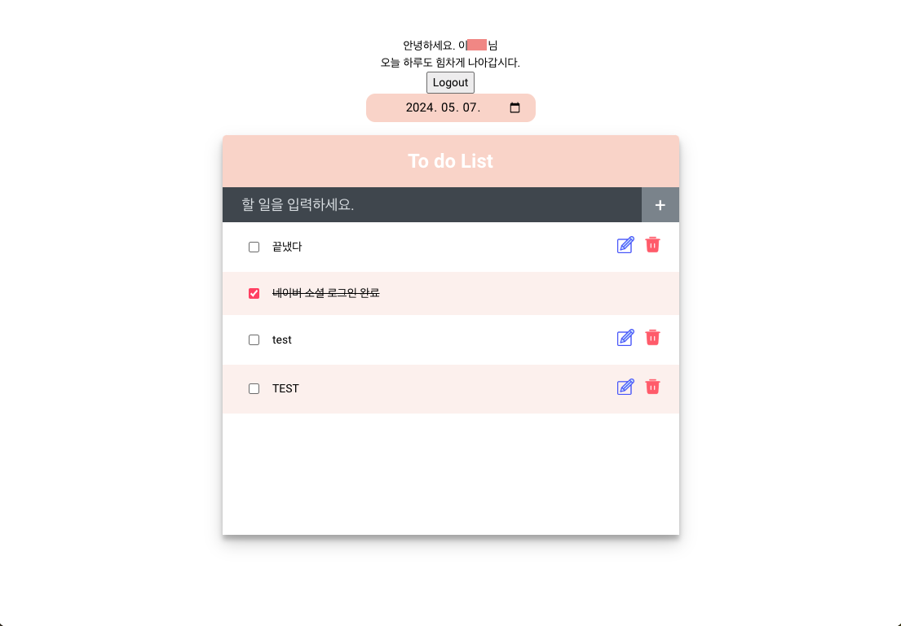
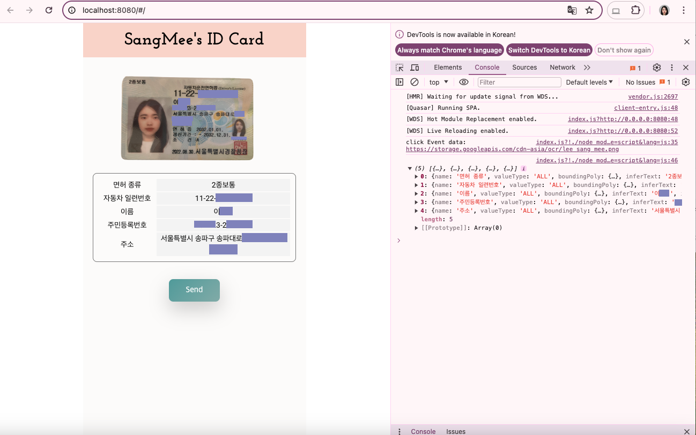
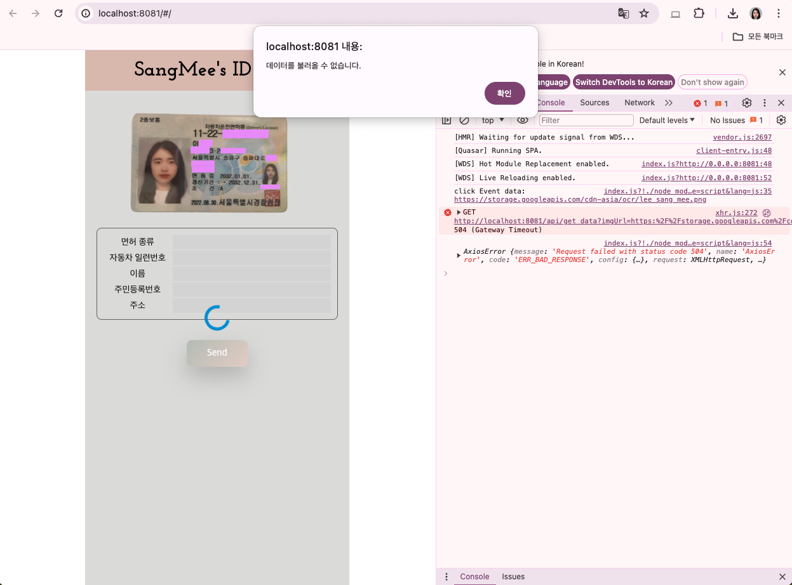

# 1. TodoList 프로젝트

오늘 날짜에 작성한 할 일을 조회 및 작성, 수정,삭제 또는 해당 날짜에 작성한 할 일 목록들을 조회

> 화면 출력 이미지는 노션 README 정리한 글 참고 링크
>   > https://www.notion.so/TodoList-eca3b8c8671c47249d0b872bf192409f?pvs=4

### 사용 기술 스택

- Naver 로그인 API
- JavaScript: `Vue2`
- Python: `FastAPI`
- Database: `MySQL`

## 1.1. DB CRUD 연동

#### 지난 날짜 조회하기 | 오늘 날짜 조회하기

<!-- 
 -->
 

### 1.1.1. 로그인

<!--  -->

#### 버튼 활성화

<!--  -->

#### 로그인 성공

<!--  -->

로그인 성공 팝업창이 뜨고 확인을 누르면 TodoList 페이지가 나타납니다.

### 1.1.2. 회원가입

<!--  -->

 

#### 유효성 검증 - 이메일 주소와 비밀번호 유효성

<!--  -->

- 이메일 형식이 맞지 않으면 주의 문구를 띄움.
- 비밀번호를 입력 후 비밀번호 재확인란에 같은 값을 입력하지 않으면 주의 문구를 띄움.

 

#### 옳은 형식을 작성했을 때의 경우

<!--  -->

#### 버튼 활성화

<!--  -->

## 1.3. 네이버 소셜 로그인

<!--  ➡️
 -->

로그인 화면에서 네이버 아이콘을 누르면 네이버 소셜 로그인 페이지로 이동합니다.
 
로그인에 성공하면 다음 아래의 페이지가 라우팅 됩니다.
  

<!--  -->
 

해당 페이지의 `이 계정으로 TodoList 로그인하기`을 누르면 TodoList 페이지로 이동합니다

<!--  -->

 

# 2. Clova OCR 프로젝트

이미지 속 텍스트를 인식하고 추출할 수 있는 기능을 제공하는 API

> 화면 출력 이미지는 노션 README 정리한 글 참고 링크
>   > https://www.notion.so/Naver-CLOVA-OCR-ID-Card-Check-688c1405862b40c3a941bd2617726d45?pvs=4

이미지 속 텍스트를 인식하고 추출할 수 있는 기능을 제공하는 API

### 사용 기술 스택

- Naver CLOVA OCR API
- JavaScript: `Vue2`
- Python: `FastAPI`

### 데이터 출력 성공

화면 출력 이미지: Notion 참고

<!--  -->

1. Send 버튼을 누를 시, 로딩 화면이 나타나며 해당 이미지 URL이 서버에 전송된다.
2. 서버는 Naver Clova OCR API를 호출하여 신분증 이미지의 특정 영역에서 text를 읽어온 결과를 JSON객체로 반환한다.
3. 서버에서 응답을 받으면 로딩 화면이 사라지고, 응답 받은 결과를 화면에 출력한다.

### 데이터 출력 실패(서버 Off)

화면 출력 이미지: Notion 참고

<!--  -->

1. Send 버튼을 누를 시, 서버가 Off 돼 있어 해당 이미지 URL이 서버에 전송되지 않는다.
2. 로딩 화면이 나타나며 팝업창이 뜬다.
