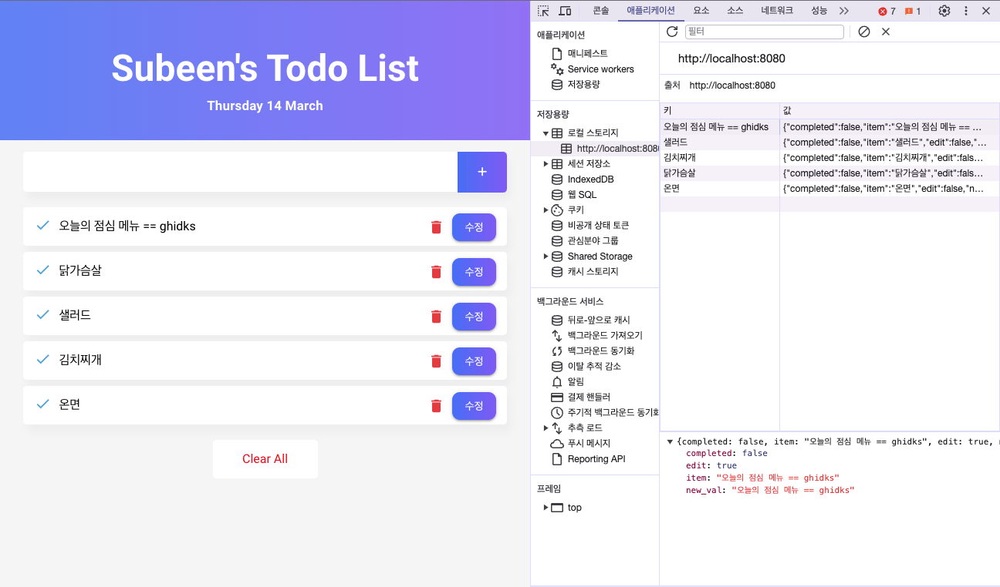
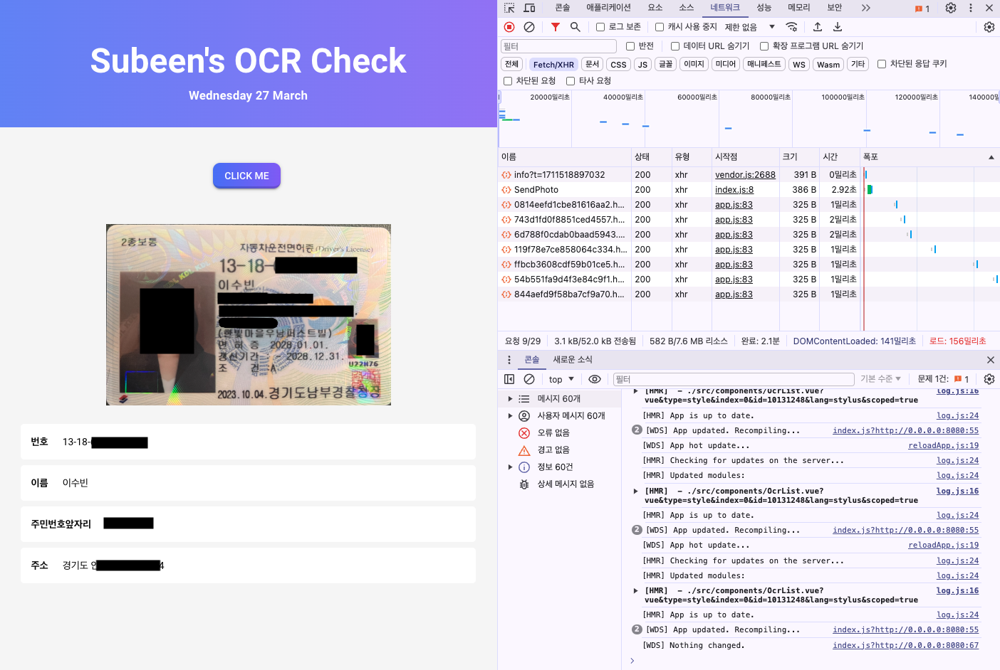
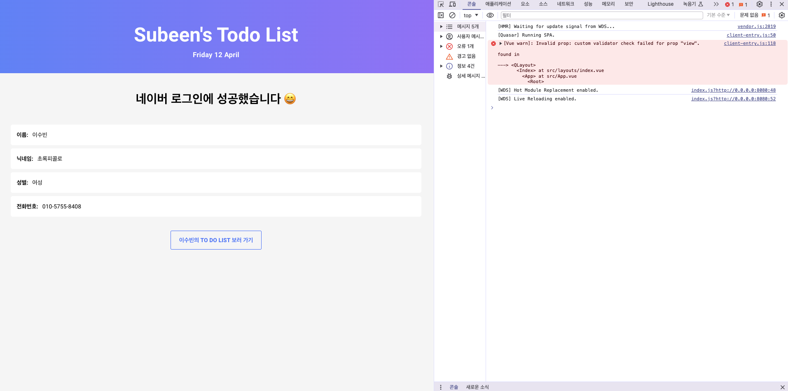
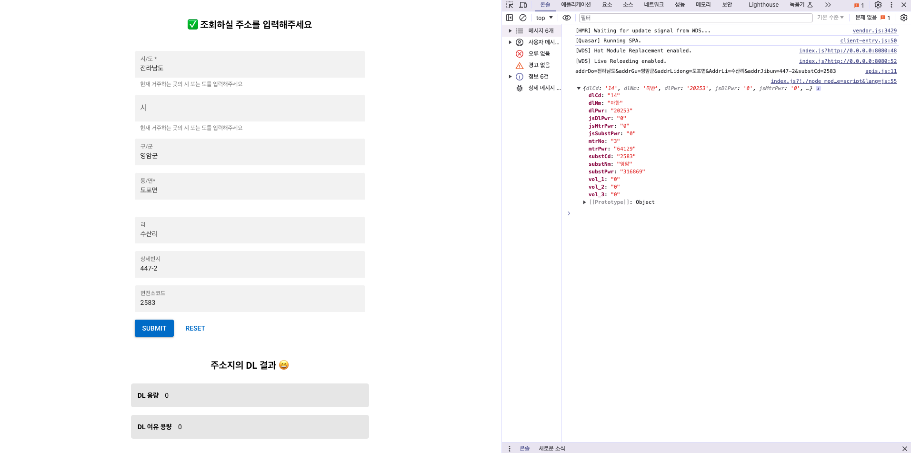

## 인턴프로젝트

### 1. To do list
* 2024-03-05 ~ 2024-03-15
* folder name: 240305_to_do_list
* Quasar, pug, localDB를 사용해서 Vue2의 CRUD 기능 구현 & Vue의 전반적인 데이터 흐름 설계

    

### 2. Naver OCR API
* 2024-03-18 ~ 2024-03-22
* folder name: 240318_OCR
* Quasar, pug, FastAPI, Axios를 사용해서 Naver OCR API의 결과값을 화면에 뿌려주기

    

### 3. Naver Login API
* 2024-03-27 ~ 2024-04-01
* folder name: 240305_to_do_list
* FastAPI, axios를 사용해서 Naver Login API를 통해 사용자의 이름, 닉네임, 성별, 전화번호 화면에 띄우기

    

### 4. 한국전력공사 분산전원 연계정보

* 2024-04-02 ~ 2024-04-04
* folder name: 240402_data_hanguck_energy
* 한국전력공사 분산전원 연계정보 API에 주소값을 조회한 결과 중 DL과 DL용량을 화면에 띄우기

    

